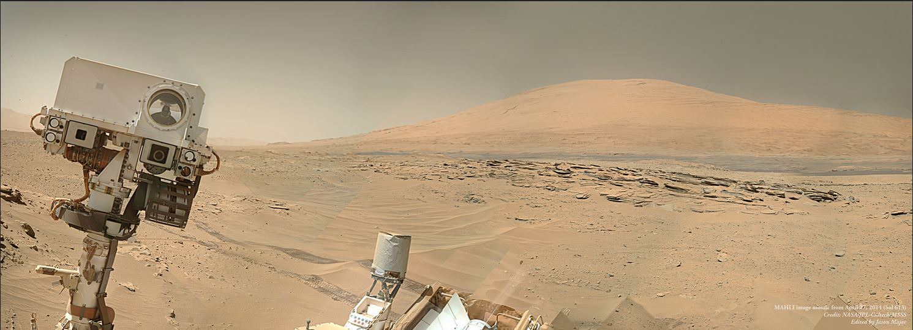

# Centeral-Cortex
Repo for our cool custom bot
## Struggling to cope with school homework? Getting distracted with memes? Need find a place of like-minded people?
**Join Curiosity!**\
\

- Categories for a multitude of subjects, from Civil Engineering to French Vocabulary
- Active Staff members
- Capable helper team
- Ever-expanding interest category
- Minimal distractions
- Zero-Tolerance policy against malicious behavior
- Debate channels
- Question of the Week!
- Looking for skilled staff members, people like you!
- Custom Bot
## Join us to discuss, relax, relieve stress and study!
\

##### What is this repository
This is a repository for our bot in our discord server.
##### Format
Every category gets its own .py file in the folder "commands"
##### Template code
template.py

# Can I fork the code?
Absolutely! This is open source code availible to anyone to use. The only thing we ask of you is to link back to the original in the "[help" command! Thanks, and have a great day!
